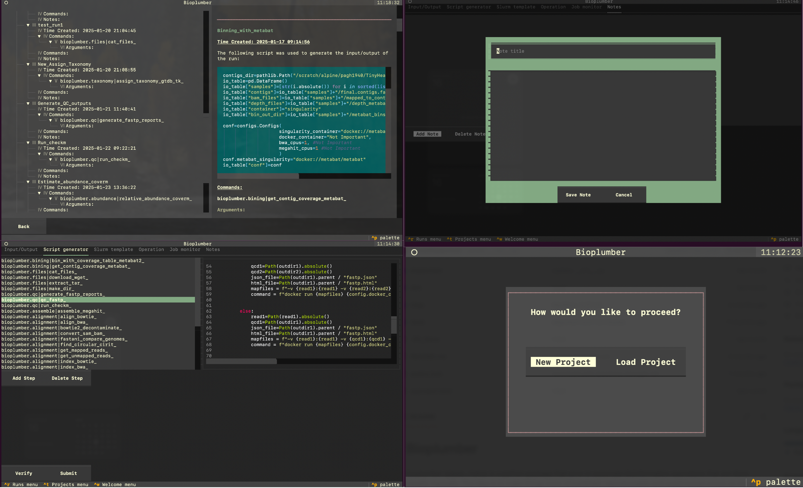

# Bioplumber


bioplumber is a python package that aims to automate bioinformatics operations that are done usually manually. The idea is to make things more streamlined, reproduceable and avoid human errors as much as possible. Except in some simple cases bioplumber does not introduce new bioinformatics tools but it tries to use other tools in a (hopefully) user-friendly way. bioplumber uses an amazing python library called [textual](https://github.com/Textualize/textual) so that it can be used in terminal.



--------------
## Installation

```bash
pip install bioplumber
```
--------------
## Usage

Currently there are two main apps in this package:

1. **pipit**: This is a TUI designed for streamlining execution of bioinformatics commands
2. **file-mgr**: This is another TUI designed for working with files for those who are more comfortable with Python.

--------------
### pipit

To run pipit, simply type the follwing in your terminal:

```bash
pipit

```
This should open the pipit interface:


A project is a collection of runs (you'll see this later) and each run is like a session comprised of multiple commands and their inputs/outputs.

Let's create a new project by clicking on the "New Project" button in the pipit interface. This takes you to a new screen:


Try to fill in all the information carefully as they show up in the notebook for this project. Once you are done, click on "Create Project" button. This should take you to the run station screen:


Now you can define a new run or reuse the old runs. To create a new one define an arbitrary run id or click on an existing one and hit "Enter Run".  
